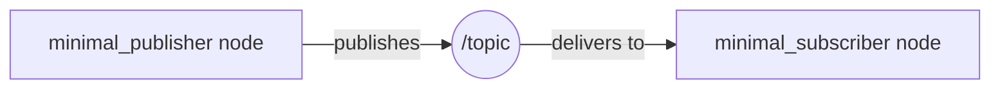

# Nodes & Topics

## The core idea

A ROS2 program is split into small, independent pieces called **nodes**.
A node is just a process that does one job — reading a sensor, running a
planner, driving a motor — and ROS2 gives it a standard way to talk to
other nodes without knowing who they are or where they're running.

That "standard way to talk" is mostly done through **topics**: named,
typed channels that nodes can publish messages onto, or subscribe to
receive messages from.

!!! tip "The radio station analogy"
    A topic works like a radio station. A publisher broadcasts on a
    frequency (the topic name) without knowing who's listening. A
    subscriber tunes into that frequency without knowing who's
    broadcasting. Neither side needs a direct reference to the other —
    they're **decoupled**. You can add a second listener, or swap out the
    broadcaster entirely, and nothing else in the system has to change.

## How this looks on the ROS2 graph

At runtime, all your nodes and topics together form what ROS2 calls "the
graph." For a single publisher and a single subscriber, it looks like
this:

A few things worth internalizing about this picture:

- **A topic is not a node.** It's a named pipe that the middleware manages
  for you — you never write code that "runs" a topic.
- **Topics are typed.** Every message sent on `/topic` has to match the
  message type the topic was created with (e.g. `std_msgs/msg/String`).
  You can't publish a `String` on a topic that expects an `Int32`.
- **Publishers and subscribers are many-to-many.** Multiple nodes can
  publish to the same topic, and multiple nodes can subscribe to it. Every
  subscriber gets every message.

## Why topics, and not just function calls?

If two pieces of your robot's software need to exchange data, why not
just call a function directly? A few reasons ROS2 pushes you toward
topics instead:

- **Nodes can run as separate processes, or on separate machines.** A
  camera driver and a perception node don't need to be linked into the
  same binary, or even run on the same computer.
   
- **One-to-many is free.** A sensor node can publish once, and a logger, a
  visualizer, and a controller can all subscribe independently — the
  publisher doesn't need to know any of them exist.
- **Nodes can restart independently.** If your visualizer crashes, your
  controller keeps running — they were never directly coupled.

The trade-off is that topics are a fire-and-forget, asynchronous pattern:
a publisher doesn't get a return value, and doesn't even know if anyone
received the message. For request/response interactions, ROS2 has a
separate mechanism (services), covered in a future guide.

## A quick note on Quality of Service

Every publisher and subscriber also has a **Quality of Service (QoS)**
profile attached — it controls things like how many past messages a late
subscriber can still receive, and whether delivery needs to be guaranteed
or can be best-effort. The default depth-10 profile used in the example
on this site is fine for learning; QoS gets its own guide once you're
ready to reason about it deliberately rather than just accepting the
default.

!!! example "Try it"
    Ready to see this in code? The [Publisher & Subscriber
    example](../examples/publisher-subscriber.md) builds exactly the graph
    pictured above, in both Python and C++.
